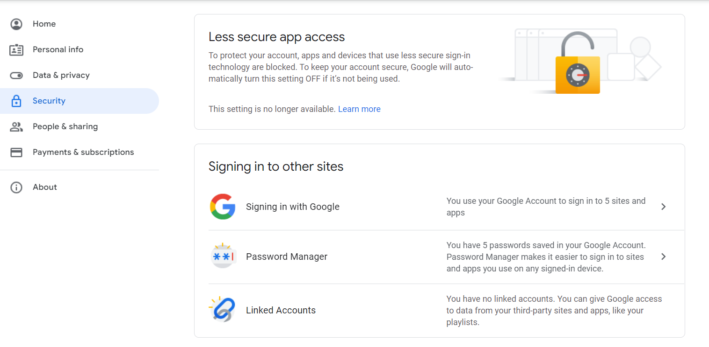

# django mail sending

If you are sending email using localhost, then follow the below steps to send an email:

Method 1:

1. Select the google account
2. Select Manage your Google Account
3. Click on Security (left side)
4. Turn on the Less Secure App
   

Method 2:
1. Select the google account
2. Select Manage your Google Account
3. Click on Security (left side)
4. Turn On the 2-step verification
   
5. After that App password will visible
6. Click on App Password
   
7. Create an App password and use that 16 character long text as gmail password for sending email

1. Add the below settings in settings.py in the project folder
```
# Sending email
EMAIL_BACKEND = 'django.core.mail.backends.smtp.EmailBackend'
EMAIL_HOST = 'smtp.gmail.com'
EMAIL_USE_TLS = True
EMAIL_PORT = 587
EMAIL_HOST_USER = 'abc@gmail.com' #sender's email-id
EMAIL_HOST_PASSWORD = 'password' #password associated with above email-id or generated App Password
```

2. Create a HTML page (index.html) and save that in templates(create if not available) folder under the app (email_app). 
#### HTML code - paste this in the HTML body
```
<form method="post" url="">
        <table>
            <tr><td>
                <span>Send A New Email</span>
            </td></tr>
            <tr>
                <td>Subject</td>
                <td><input type="text" name="subject" required></td>
            </tr>
            <tr>
                <td>Message</td>
                <td><textarea name="message" required></textarea></td>
            </tr>
            <tr>
                <td>Receiver Email</td>
                <td><input type="email" name="receiver_mail" required></td>
            </tr>
            <tr>
                <td><input type="submit" name="submit"></td>
            </tr>
            <tr>
                
                <td>Email Sent Successfully</td>
                
            </tr>
        </table>
    </form>
```

#### CSS Code - use this code inside the HTML head tag
```
    <style>
        span
        {
            font-weight: 500;
            font-size: x-large;
            font-style: italic;
        }
    </style>
```
3. Write the view function for email sending
```
from django.conf import settings
from django.core.mail import send_mail


def send_email(request):
    if request.method == 'POST':
        recipient = request.POST.get('receiver_mail')
        subject = request.POST.get('subject')
        message = request.POST.get('message')
        email_from = settings.EMAIL_HOST_USER
        mail_status = send_mail(subject, message, email_from, [recipient], fail_silently=False)
        return render(request, 'index.html', {'status': mail_status})
    else:
        return render(request, 'index.html', {})
 ```
4. Create urls.py in the app (email_app) and the below code
```
from django.urls import path
from email_app.views import send_email

urlpatterns = [
    path('', send_email, name='send_email')
]
```